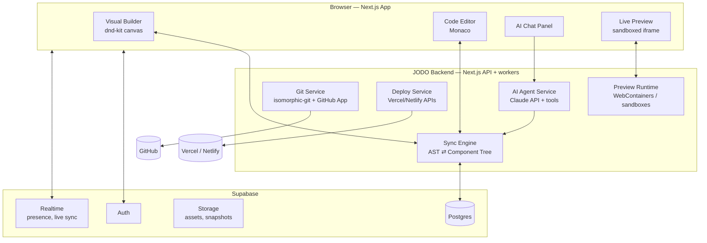

# JODO — Technical Architecture Plan

**Version 1.0 · July 2026 · Confidential**

JODO is a web platform where users visually build websites (drag-and-drop), edit the underlying code directly (VS Code-style), get help from an AI agent that can read and modify their project, and push/deploy to a real GitHub repo — in the coding stack of their choice.

The core differentiator vs. Shopify/Wix/WordPress: **the visual builder and the code are the same artifact.** Users are never locked into "color and font" editing — every project is real, exportable, standard code.

---

## 1. Product Pillars

1. **Visual Builder** — drag-drop canvas with components, resize, style controls, responsive breakpoints.
2. **Code Editor** — Monaco (the editor inside VS Code) with full file tree; edits sync back to the visual canvas.
3. **AI Agent** — chat panel powered by Claude; can read, edit, create files and components with user approval.
4. **Repo + Deploy** — every project is a Git repo; connect GitHub, one-click deploy via Vercel/Netlify APIs.
5. **Stack choice** — users pick their project's stack: HTML/CSS/JS, React/Next.js, Vue/Nuxt, optional Node.js backend.

---

## 2. System Architecture Overview



---

## 3. Tech Stack

| Layer | Choice | Why |
|---|---|---|
| Framework | **Next.js 15 (App Router) + React 19 + TypeScript** | One codebase for UI + API routes; best ecosystem for the tools below |
| UI / styling | Tailwind CSS + Radix UI primitives + Framer Motion | Fast to build the neon-purple design system; accessible primitives |
| Drag & drop | **dnd-kit** | Modern, headless, handles nested droppables (component trees) |
| Code editor | **Monaco Editor** (`@monaco-editor/react`) | Literally VS Code's editor: IntelliSense, themes, multi-file |
| Code parsing | **Babel (@babel/parser) + recast** for JS/JSX, **posthtml/parse5** for HTML, **@vue/compiler-sfc** for Vue | Round-trip code ⇄ tree without destroying user formatting (recast preserves it) |
| In-browser preview | **WebContainers (StackBlitz)** for Node/React/Vue projects; plain sandboxed iframe for static HTML | Runs `npm install` + dev server fully in the browser — no server cost per preview |
| AI | **Claude API** (Sonnet for chat/edits, Haiku for autocomplete/cheap tasks) with tool use | Agentic file editing via tools; streaming responses |
| DB / Auth / Storage / Realtime | **Supabase** (Postgres, RLS, Auth, Storage, Realtime) | One service, generous free tier, row-level security for multi-tenancy |
| Git | **GitHub App** (OAuth + installation tokens) + isomorphic-git server-side | Push/pull/branch on behalf of users with fine-grained repo permissions |
| Deploy | **Vercel API** (primary) + **Netlify API** (secondary) | One-click deploys, preview URLs, custom domains — zero infra to run |
| Background jobs | Vercel Queues / Inngest | Deploy polling, repo syncs, snapshot pruning |
| Payments (later) | Stripe | Subscriptions per plan |
| Monitoring | Sentry + PostHog | Errors + product analytics |

---

## 4. The Hard Problem: Two-Way Sync (Visual ⇄ Code)

This is what makes or breaks JODO. Design decision: **code is the source of truth**, and the visual builder is a *projection* of it.

### 4.1 How it works

1. Every project file is parsed into an AST (Babel for JSX, parse5 for HTML, compiler-sfc for Vue).
2. The Sync Engine maps AST nodes → a normalized **Component Tree** (JSON) that the canvas renders.
3. Visual edits (drag, resize, style change) are translated into **AST patches** and written back with `recast`, which preserves the user's formatting, comments, and hand-written code.
4. Code edits in Monaco re-parse the file (debounced) and re-project the canvas.
5. Elements the parser can't map (complex logic, dynamic children) render on canvas as "code blocks" — selectable, movable as a unit, but editable only in code or via AI. **Never silently rewrite what we don't understand.**

### 4.2 Styling strategy

Generated components use Tailwind classes (or plain CSS for the HTML stack). Visual style controls (color, font, spacing, radius, shadow) map deterministically to class edits. Arbitrary hand-written CSS is respected and surfaced as "custom styles" in the inspector.

### 4.3 Component model

- **Primitives:** Section, Container, Grid, Text, Heading, Image, Button, Link, Form, Input, Video, Icon, Embed.
- **Templates:** Navbar, Hero, Features, Pricing, Testimonials, Footer, Blog list, Product grid.
- Each primitive = a real code component in the user's stack, not a proprietary widget. Delete JODO tomorrow and the code still runs.

---

## 5. Project Stacks (user's choice at project creation)

| Stack | Generated project | Preview | Deploy |
|---|---|---|---|
| HTML/CSS/JS | Multi-page static site, vanilla JS, optional Tailwind CDN | iframe | Vercel/Netlify static |
| React (Vite) or Next.js | Component-per-section, App Router pages | WebContainers | Vercel |
| Vue 3 / Nuxt | SFCs per section | WebContainers | Vercel/Netlify |
| + Node.js backend (add-on) | Express/Next API routes, Supabase client wired in | WebContainers | Vercel serverless |

V1 ships HTML + React/Next first-class; Vue enters beta after the sync engine is stable (each stack = its own parser/printer pair, the most expensive part to add).

---

## 6. AI Agent Architecture

The chat panel is an **agent with tools**, not a text generator.

### 6.1 Tools exposed to Claude

| Tool | Purpose |
|---|---|
| `list_files` / `read_file` | Explore the project |
| `write_file` / `edit_file` (string-replace) | Modify code |
| `add_component` / `update_styles` | High-level ops that go through the Sync Engine (safer than raw writes for canvas-managed nodes) |
| `search_project` | Grep across files |
| `run_preview_check` | Build the project in the sandbox, return errors |
| `commit` / `deploy` | Git + deployment actions |

### 6.2 Safety & UX rules

- Every AI file change lands as a **pending diff** the user approves/rejects (like a mini PR review) — with an "auto-apply" toggle for users who trust it.
- Agent runs `run_preview_check` after edits; if the build breaks, it self-corrects before presenting the diff.
- Context management: system prompt carries project manifest (stack, file tree, design tokens); files are read on demand, not dumped wholesale.
- Rate limiting + per-plan token budgets (AI cost is the #1 margin risk — meter it from day one).
- Model routing: Haiku for quick Q&A/renames, Sonnet for feature builds, escalation option for complex refactors.

### 6.3 Example flows

- "Make the hero section match my logo colors" → reads design tokens + hero file → edits classes → diff.
- "Add a contact form that emails me" → creates form component + API route + explains the env var needed.
- "Why does my page look broken on mobile?" → reads files, runs preview check, proposes responsive fixes.

---

## 7. Git & Deployment

### 7.1 GitHub integration (GitHub App, not plain OAuth)

- User installs the JODO GitHub App on chosen repos/org → JODO gets fine-grained, revocable, per-repo tokens.
- Project ⇄ repo mapping stored in DB. JODO commits with a bot identity co-authored by the user.
- **Import existing repo:** clone → parse → whatever maps, appears on canvas; the rest is editable in code/AI. (Ship export-first in MVP; import is V1.1 — it's the harder direction.)
- Branch model: canvas/AI edits go to a `jodo` working branch; user can PR to `main` or commit direct (their choice in settings).
- Conflict policy: if the repo changed outside JODO, pull + rebase; on conflict, surface a simple "theirs/ours/open in editor" resolution UI.

### 7.2 Deployment

- **Vercel API** (primary): create project, link repo or direct-upload build output, trigger deploy, poll status, return URL.
- Custom domains via Vercel domain API; JODO subdomain (`myproject.jodo.site`) free on every plan.
- Deploy history with one-click rollback (re-promote previous deployment).
- Env vars UI (encrypted at rest in Supabase, pushed to Vercel via API) for projects with backends.

---

## 8. Data Model (Supabase / Postgres)

```sql
users            (id, email, name, avatar_url, plan, ai_tokens_used, created_at)
organizations    (id, name, owner_id)                     -- teams, post-V1
projects         (id, owner_id, org_id?, name, slug, stack,        -- 'html' | 'react' | 'nextjs' | 'vue' | 'nuxt'
                  has_backend bool, github_repo, default_branch,
                  vercel_project_id, design_tokens jsonb, created_at, updated_at)
project_files    (id, project_id, path, content text, updated_at, updated_by)  -- working copy
snapshots        (id, project_id, label, files_ref, created_at)   -- point-in-time restore (zips in Storage)
deployments      (id, project_id, provider, provider_id, url, status, commit_sha, created_at)
ai_conversations (id, project_id, user_id, created_at)
ai_messages      (id, conversation_id, role, content, tool_calls jsonb, tokens, created_at)
ai_pending_diffs (id, project_id, message_id, file_path, diff, status)  -- approve/reject queue
components_library(id, project_id?, name, stack, source, thumbnail) -- saved/reusable sections
```

- **RLS everywhere:** every table row-scoped to owner/org membership.
- Working copy lives in Postgres (fast editor loads); Git is the durable history; snapshots are the "oops" button between commits.
- Supabase Realtime broadcasts file/tree changes → enables live collaboration later without re-architecture.

---

## 9. Security

- Preview execution is fully client-side (WebContainers/iframe sandbox) → user code never runs on JODO servers in V1. This kills the biggest attack surface cheaply.
- Sandboxed iframes: `sandbox` attr, separate origin (`*.jodo-preview.site`), CSP.
- AI prompt-injection defense: agent tools are scoped to the user's own project; no cross-project reads; deploy/commit tools require explicit user confirmation regardless of auto-apply.
- Secrets: env vars AES-encrypted, never sent to the AI model, masked in UI.
- GitHub tokens: installation tokens fetched on demand, never stored long-lived.

---

## 10. UI Design — Neon Purple System

**Feel:** dark, modern, electric — Linear × Vercel with a neon edge.

| Token | Value |
|---|---|
| Background | `#0A0118` (near-black purple) |
| Surface / panels | `#140B26`, borders `#2A1B4A` |
| Primary | `#8B5CF6` → gradient to `#D946EF` |
| Neon accent | `#A855F7` with glow (`box-shadow: 0 0 24px rgba(168,85,247,.45)`) |
| Success / warn / error | `#34D399` / `#FBBF24` / `#FB7185` |
| Text | `#F3EFFF` primary, `#9D8FC0` secondary |
| Fonts | **Space Grotesk** (display/logo), **Inter** (UI), **JetBrains Mono** (code) |

**Layout (the editor screen):** left rail = pages/layers/components/assets · center = canvas ⇄ code toggle (or split view) · right = inspector (style controls) · bottom-right floating = AI chat panel · top bar = breakpoint switcher, undo/redo, preview, **Deploy** (glowing gradient button).

---

## 11. Roadmap

### Phase 0 — Foundation (weeks 1–3)
Next.js app scaffold, Supabase auth + schema, design system, dashboard (create project → pick stack → template gallery).

### Phase 1 — MVP (weeks 4–10)
- HTML/CSS/JS stack only
- Canvas: drag-drop primitives + 8 template sections, inspector (color/font/spacing/size), responsive breakpoints
- Monaco with file tree; **one-way sync first** (canvas → code), then two-way for the HTML parser
- iframe live preview
- AI chat with read/edit tools + diff approval
- Export as ZIP + push to GitHub + Vercel deploy
- **Exit criterion:** a user builds and deploys a real multi-section site without touching another tool.

### Phase 2 — V1 (weeks 11–20)
React/Next.js stack (Babel/recast sync engine), WebContainers preview, saved components library, snapshots/rollback, custom domains, Stripe plans, AI `run_preview_check` self-correction.

### Phase 3 — V1.5+ (months 6–9)
Vue/Nuxt stack, Node backend add-on + env vars UI, import existing repos, realtime collaboration (Supabase presence), marketplace for community components/templates.

---

## 12. Business Notes

- **Plans:** Free (1 project, jodo.site subdomain, capped AI tokens) · Pro ~$20/mo (unlimited projects, custom domain, higher AI budget) · Team (orgs, collaboration).
- **Margin watch-items:** Claude token spend (meter + route models), Vercel deploy costs (their API pricing), Supabase egress.
- **Name check (do before launch):** JODO trademark search (USPTO/EUIPO, software class 9/42) and domain — jodo.com is likely taken; jodo.dev / jodo.app / jodo.site are realistic. Note "Jodo" is also a Japanese martial art and a Buddhist term (Jōdo/Pure Land) — no conflict, but be aware for SEO.

## 13. Top Risks

1. **Two-way sync complexity** — mitigated by: code-as-source-of-truth, recast formatting preservation, "code block" fallback for unparseable nodes, HTML stack first.
2. **AI cost blowout** — token metering, model routing, per-plan budgets from day one.
3. **Scope creep** — each stack ≈ its own parser/printer; resist adding stacks before HTML+React are excellent.
4. **Preview reliability** — WebContainers needs cross-origin isolation headers (COOP/COEP); test early, keep iframe fallback.

---

*Next step after approval: Phase 0 scaffold — Next.js repo, Supabase project, design system with the tokens above.*
